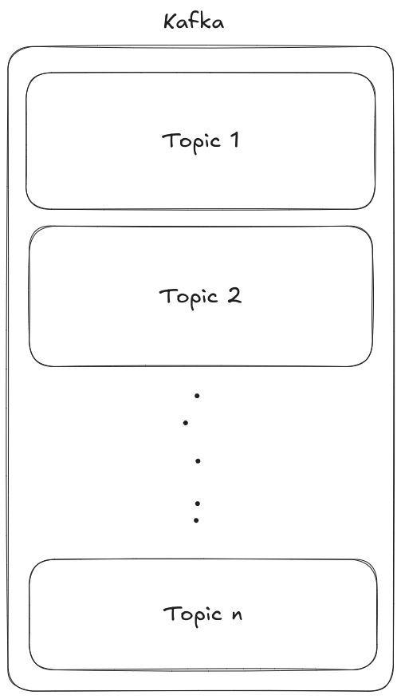

# Kafka

Kafka is a distributed streaming platform that solves several problems related to real-time data processing, data integration, and event-driven architectures. Here's an introduction to Kafka and the problems it solves:

# Introduction to Apache Kafka

Apache Kafka is an open-source, distributed event streaming platform designed to handle real-time data feeds. It was originally developed by LinkedIn and later donated to the Apache Software Foundation. Kafka is widely used in various industries for building real-time data pipelines, streaming applications, and event-driven architectures.

## Imagine a situation

We want to store the data into db in every sec for single user. It will works for small scale but when our users increases then our db cannot able to handles such large volumes of insertion operation (ops - Operation per seconds) and it goes down.

---

_Before diving into detail of kafka, first let’s understand the **pub/sub** architecture_

In pub/sub architecture there are two parties

- Publisher (producer)
- Subscriber (consumer)

Publisher publishes (produce) the data while subscriber subscribes (consumes) to the data which is produced by publisher.

## Throughput

- Performing ops is known as throughput
- Throughput is the term which is measured by the time taken by the database to perform operations like CRUD.
- Usually databases have low throughput.
- When we perform a lot of operations at a time then database may down.

## Kafka vs DB

|           | **Throughput** | **Storage** |
| --------- | -------------- | ----------- |
| **Kafka** | High           | Low         |
| **DB**    | Low            | High        |

## Kafka comes in picture

- Kafka have high throughput and temporary storage.
- It can handles millions of incoming request and perform the bulk insertion between regular interval of time, which leads to efficient use database resources and less number of operations on database.
- Imagine the application like UBER where there are many drivers which produces the data (like location every seconds) and users which consumes the data (like location every seconds), During this situation kafka plays the crucial role by handling all database request and perform bulk insertion within certain duration.

# Kafka Internals

1 Kafka cluster contains multiple topics AKA Logical partitions.

Producers produces message into specific topic and consumer consumes message from specific topics

## Partitions

Kafka contains topics and topics contains partitions

Like data splitting, store half data in p1, and half in p2 etc…

It depends on us that in which partition we want to store the data.

## Autobalancing

Suppose we have 1 kafka cluster with 1 topics and 4 partitions.

If we have one consumer then by default kafka gives data from all partitions to that single consumer

If we have 4 consumer then each consumer will consume each partition

## Important note

Single consumer can consume multiple partition but one partition can only be consumed by 1 consumer

1 consumer (consumes) → multiple partitions

1 partition (provide data to only) → 1 consumer

## Consumer group

To overcome above problem we have another concept known as consumer group.

Where we create consumer group. suppose we have two groups: G1 and G2, they have 4 & 1 consumers respectively.

We have 4 partitions in kafka. the outcome will be

G1 → consumes all 4 partitions by all 4 topics

G2 → all 4 topics is consumed by 1 consumer

Why this?

Mainly there is two types of architecture

- Queue - 1 producer and 1 consumer.
- PubSub (Publisher, Subscriber) → 1 producer multiple consumer.

Kafka follows PubSub or/and queue architecture using consumer group.

# Running kafka locally

To run kafka locally we require image named `zookeeper` to manage the topics, partitions and auto balancing.

- `zookeeper` runs on port no. **2181**
- `kafka` runs on port no. **9092**

Here we requires infrastructure setup (no of topics, partitions etc…)

- `admin` setups infrastructure
- `producers` produces message
- `consumers` consumes message
